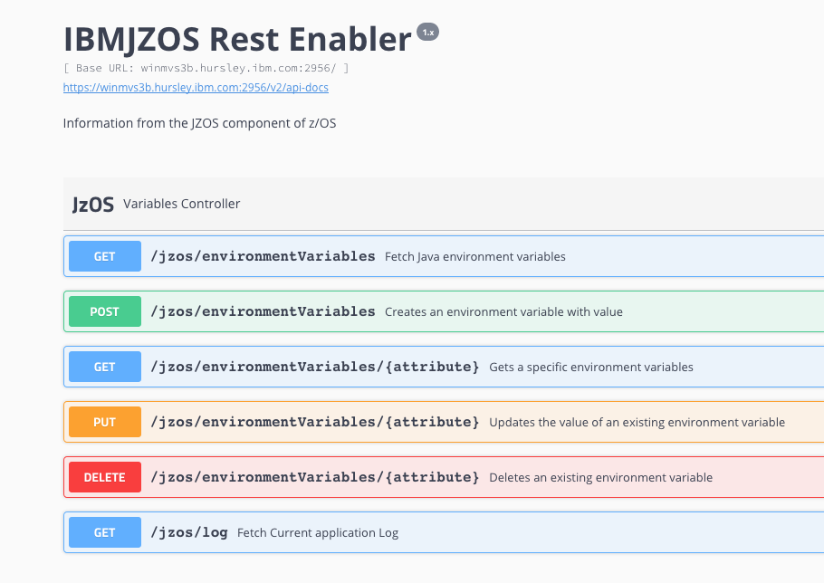
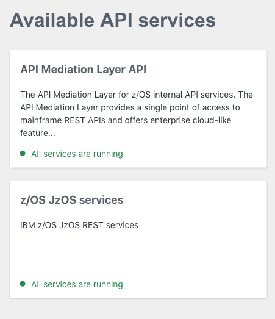

# spring-boot-jzos-sample

The intent of this sample is primarily to be a test application that can demonstrate onboarding to Zowe. By creating a Spring Boot App we can quickly demonstrate a z based Rest API application 

It is also a good sample for anyone wishing to create a Rest API Spring Boot application that creates swagger2.

This sample uses JZOS to provision a Rest API for accessing Java environmental variables. 
 

:::warning
It should be noted that the executable code in this example runs under the user id of whoever started the process and not that of the user accessing the RestAPI. Since the sample demonstrates the full range of REST functions: GET, PUT, POST and DELETE anyone logging in is potentially able to change environmental variables of the originating user. For that reason this sample should only be used in development scenarios.
:::

## Prerequisites 

* Build requires Maven installed on local machine

### Keystore
As this sample runs using HTTPS you need to reference a key store or create your own. Although creating your own is relatively straight forward I have reused the one used by the API mediation layer. It's worth noting that at the time of writing this Readme I have used a relative reference to the keystore and you should update based upon the location of the Zowe keystore used. 
  
  
### IBMJZOS.jar
The app has a dependency on IBMJZOS so for compiling you need to download from your z/OS installation. Simply download the file from your Java installation on the z/OS server. $JAVA_HOME/lib/ext/ibmjzos.jar call it ibmjzos-1.0.jar and save in the /libs folder of this project.  

## Procedure

* Download this sample to your local machine. 
* Download IBMJZOS from the host machine running Zowe as described above creating the libs folder in your project and adding the ibmjzos-1.0.jar file. This file is referenced when compiling only.
* Build the sample and transfer the file /jzos/target/jzos-0.0.1-SNAPSHOT.jar to a USS folder on the Zowe server. (mvn clean verify)
* Transfer the jzos.sh file from the project root folder to the same USS folder on the Zowe server.
* Modify the shell script as necessary for the environment

### Shell Script

The shell script builds the required command to specify the classpath and set environmental properties. Please check the valiidity on your system of:
* Location of JAVA_HOME
* Your installation location
* An available port number

It is envisaged that you will eventually set this to run as a service but will suffice for a sample. 
 
### Access swagger

Use the address https://{zowe installation host}:{your defined port}/api/v1/swagger-ui.html to access the swagger page. Scroll down to click on JzOS Variables controller then choose "Try it out" and then "Execute" to make sure the API works.

### Introduce your application to the Gateway. 

To allow your application to be accessible through the API Gateway you need to add a yaml file to the API-definitions folder. Use the zowe-api-jzos-mediation-configure.sh script to achieve this. You will need to add the following values into the script.

```
# Fill in the following variables
ZOWE_ROOT_DIR=    # The root directory of the Zowe installation
ZOWE_EXPLORER_HOST=   # Host name of the Zowe installation
JZOS_PORT=57949       # The address where your application is running 
```

Run this script and the yaml file will be created with the appropriate configuration. Restart Zowe to pick up the definition 

### Access through the Gateway

 